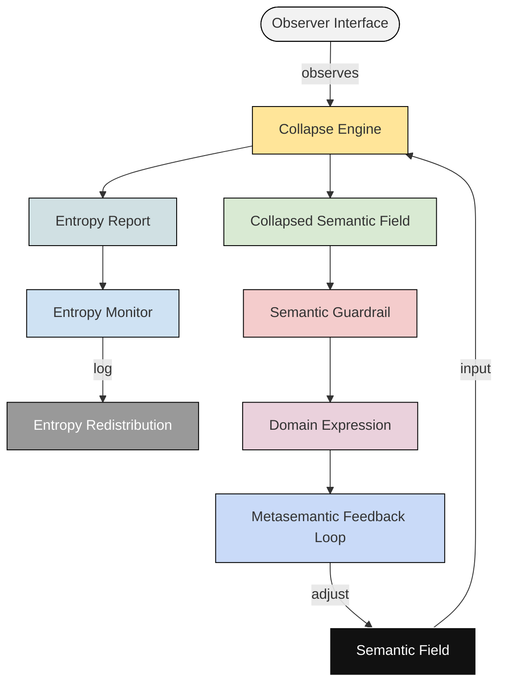

# `semantic_entropy_collapse_engine`

This diagram illustrates the internal logic of the `semantic_entropy_collapse_engine`, a conceptual model for how meaning collapses under observation in a structured semantic system. The model is inspired by quantum measurement analogies, information entropy, and language processing theory.

It processes semantic fields based on observer input, calculates entropy shift, and applies semantic guardrails before producing domain-specific expressions. A metasemantic feedback loop ensures the system can iteratively refine itself through its own outputs.

---

---

## 🔍 Component Breakdown

| Node                           | Description                                                                    |
| ------------------------------ | ------------------------------------------------------------------------------ |
| **Observer Interface**         | Receives external signals (queries, inputs) and initiates semantic evaluation. |
| **Semantic Field**             | Latent, multi-potential semantic space prior to collapse.                      |
| **Collapse Engine**            | Core engine that selects meaning from potential states under observation.      |
| **Collapsed Semantic Field**   | The resulting narrowed semantic state post-collapse.                           |
| **Entropy Report**             | Measures the semantic entropy shift during collapse.                           |
| **Entropy Monitor**            | Tracks and balances entropy flow to maintain system coherence.                 |
| **Entropy Redistribution**     | Redistributes excess entropy into peripheral semantic states or logs it.       |
| **Semantic Guardrail**         | Filters hallucinations, over-symbolization, and semantic drift.                |
| **Domain Expression**          | Final structured output as meaningful language or symbols.                     |
| **Metasemantic Feedback Loop** | Feeds back output into the semantic field for iterative model refinement.      |
